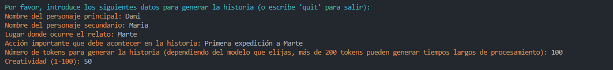
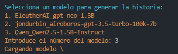
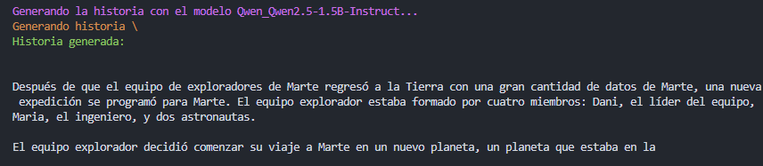
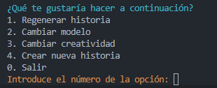

# Generador de Historias con IA

Este proyecto permite generar historias con IA utilizando diferentes modelos de texto. A continuación se detallan los pasos para instalar y ejecutar el proyecto.

## Requisitos

- Python 3.6 o superior
- pip (gestor de paquetes de Python)

## Instalación

### 1. Clonar el repositorio del servidor de modelos

Primero, clona el repositorio [text-generation-webui](https://github.com/oobabooga/text-generation-webui) que se utilizará para tener el servidor donde trabajarán nuestros modelos:

```sh
git clone https://github.com/oobabooga/text-generation-webui
```

### 2. Ejecutar el servidor de modelos
- En windows
  ```sh
  ./start_windows --api --cpu
  ```

- En linux
  ```sh
  ./start_linux --api --cpu
  ```

- En macOS
  ```sh
  ./start_macOS --api --cpu
  ```

Si tienes GPU, puedes usar `--gpu` en lugar de `--cpu`

En la primera ejecucción sigue los pasos de instalación, para más información consulta la [wiki de text-generation web-ui](https://github.com/oobabooga/text-generation-webui/wiki).

### 3. Accerder a Web UI

Una vez instalado, accede a `http://127.0.0.1:7860` donde estará corriendo el Web UI. En esta página, ve a la pestaña Models y en el apartado ``Download`` descarga los modelos que quieras usar.

### 4. Instalar dependencias del proyecto

Vuelve a este proyecto (dejando el otro corriendo en segundo plano) y ejecuta el siguiente comando para instalar las dependencias:

```sh
pip install -r requirements.txt
```

### 5. Ejecutar el generador de historias
Una vez instaladas las dependencias, ejecuta el siguiente comando para iniciar el generador de historias:

```sh
python3 history-generator.py
```

### 6. Usar el menú de navegación por consola
#### Guía de uso

Primero se nos solicitará una serie de información para desarrollar la historia junto a los parámetros `max_tokens` y `temperature` para controlar la langitud de la historia y la creatividad a la hora de la generación.



Lo siguente será selecciónar un modelos de nuestra lista de modelos, lo haremos indicando el número del modelos que queremos y este se cargará-.
> La lista de modelos se extrae de la api de text-generation web-ui, por lo que se nos mostrara los modelos que tengamos descargados en la carpeta models



A continuación empezará a generarse la historia, una vez generada se nos mostrará por consola.



Y por último se nos mostrará un menú de con las siguentes opciones
1. **Regenerar historia:** Volverá a generar la historia con los mismos datos, parámetros y modelo.
2. **Cambiar modelo:** Nos permitará volver a generar la historia con los mismos datos y parámetros pero podremos seleccinar un modelos diferente.
3. **Cambiar creatividad:** Nos permitirá generar la historia de nuevo con los mismo datos y parámetros pero con un nuevo grado de creatividad.
4. **Crear nueva historia:** Se nos volverá a solicitar todos los datos, parámetros y que modelos queremos usar para generar una nueva historia.
5. **Salir:** Termina la ejecución del programa



#### Notas

- Asegúrate de que el servidor de modelos esté corriendo en segundo plano mientras usas el generador de historias.
- Para más información sobre el servidor de modelos, consulta la wiki del proyecto.

## Ejemplos de uso

En estos ejemplos se han usado los siguentes modelos
- Modelos pequeños (tiempos razonables en cpu)
  - [EleutherAI/gpt-neo-1.3B](https://huggingface.co/EleutherAI/gpt-neo-1.3B)
  - [Qwen/Qwen2.5-1.5B-Instruct](https://huggingface.co/Qwen/Qwen2.5-1.5B-Instruct)
- Modelo grande, probado en GTX 3060 TI (en cpu genera tiempos de espera muy largos)
  - [jondurbin/airoboros-gpt-3.5-turbo-100k-7b](https://huggingface.co/jondurbin/airoboros-gpt-3.5-turbo-100k-7b) 

De estos 3 modelos obviamente el que genera mejores resultados es `jondurbin/airoboros-gpt-3.5-turbo-100k-7b` pero necesitaremos tener una gráfica potente, en caso de no disponer de una, ``Qwen/Qwen2.5-1.5B-Instruct`` puede ser una buena opción, quizás usando prompt en ingés daría incluso mejores resultados.

#### Historias generadas por `EleutherAI/gpt-neo-1.3B`
##### Parámetros
- **Personaje principal:** Pepe
- **Personaje secundario:** Maria
- **Escenario:** Budapest
- **Acción importante que debe acontecer en la historia:** Pepe y Maria se casan
- **Número de tokens:** 200
- **Creatividad:** 70

Resultado:
```sh
 Además, el único medio de transporte disponible para el viaje de Pepe y María será un autobús, pero el autobús debe estar lleno de pasajeros. 
 La mitad de los pasajeros en el autobús deben ser mujeres, y ninguna de ellas puede ser María. 
 Todo el viaje debe durar 12 horas, y la mitad del tiempo debe ser en la ruta de Budapest a Varsovia.

Pepe es un hombre de 35 años que trabaja en una oficina de computadora en Budapest. Un día, Pepe se encuentra con un montón de trabajo y decide tomar un taxi para llegar a su casa. 
Pero un problema de Üniversatz ha hecho que el taxi no pueda retirar dinero del cajero automático. Pepe se siente frustrado y decide tomar un autobús para poder llegar a su casa.

Pepe encuentraCppClass un autobús lleno de pasajeros y decide buscar una buena ubic
```
---
Mismos parámetros pero cambiamos la creatividad
- **Creatividad:** 20
  
Resultado:
```sh
Pepe es un joven de 25 años que vive en Budapest, es un hombre de negocios que trabaja en una empresa de turismo. 
Es un hombre de negocios que trabaja en una empresa de turismo. Su vida es tranquila hasta que un día, en una de sus vacaciones, se encuentra con una mujer llamada María, que es una artista de Budapest.

Pepe y María se conocen y se enamoran rápidamente. Ella es una mujer con una personalidad fuerte y independiente, y él es un hombre con una personalidad tranquila y segura.

Después de una semana de amor, Pepe y María se dan cuenta de que tienen muchas cosas en común y deciden casarse.

Cuando Pepe y María se casan, todo el mundo en Budapest los felicita y los felicita.

Pepe y María son una pareja muy feliz y se sienten muy afortunados.
```

#### Historias generadas por `Qwen/Qwen2.5-1.5B-Instruct`
##### Parámetros
- **Personaje principal:** Jairo
- **Personaje secundario:** Ramón
- **Escenario:** Cañón del colorado
- **Acción importante que debe acontecer en la historia:** Jairo cree ver un extraterrestre en la lejanía
- **Número de tokens:** 200
- **Creatividad:** 80

Resultado:
```sh
 En la historia Jairo debe tener un recuerdo de una mascota que fue de Ramón (Cerca del final) y no debe haber más de un enredo de amor que se desarrolle. 
 Jairo debe encontrar al intruso.  La historia tiene que ser narrada en un formato de noticias, y debe ser corta pero contundente.

---

En el corazón del Amargueña, en la impresionante Cañón del Colorado, se encuentra un secreto que aún no ha sido descubierto por los pueblos habitantes. Un día, cuando Jairo, un aventurero en busca de aventuras, se desplaza por las montañas, encuentra una simple, pero hermosa cabaña abandonada. Sobre la mesa, se encuentra un anuncio de publicidad antiguo que le dice que el dueño de la cabaña es el legendario cazador Ramón. Impulsionado por el amor.
```
---
##### Parámetros
- **Personaje principal:** Dani
- **Personaje secundario:** Luis
- **Escenario:** Clase de inteligencia artificial
- **Acción importante que debe acontecer en la historia:** Luis le da a dani su nota final de la asignatura
- **Número de tokens:** 200
- **Creatividad:** 30
  
Resultado:
```sh
 Dani es un estudiante de 17 años que se ha formado en inteligencia artificial. Luis es su profesor de IA. El curso se ha acortado debido a la pandemia. Dani ha estado trabajando en una IA que puede aprender a leer y escribir. Luis ha estado trabajando en una IA que puede hacer tareas de inteligencia artificial. Ellos se conocieron en la clase de IA. En la clase, Dani ha estado trabajando en una IA=suma de 10 tokens. Luis ha estado trabajando en una IA que puede hacer tareas de inteligencia artificial=suma de 10 tokens. En la clase, Dani ha estado trabajando en una IA que puede leer y escribir=suma de 10 tokens. Luis ha estado trabajando en una IA que puede hacer tareas de inteligencia artificial=suma de 10 tokens. En la clase, Dani ha estado trabajando en una IA que puede leer y escribir historias.
```

#### Historias generadas por `jondurbin/airoboros-gpt-3.5-turbo-100k-7b`
- **Personaje principal:** Jairo
- **Personaje secundario:** Ramón
- **Escenario:** Cañón del colorado
- **Acción importante que debe acontecer en la historia:** Jairo cree ver un extraterrestre en la lejanía
- **Número de tokens:** 200
- **Creatividad:** 100
- 
 Resultado:
```sh
El sol se apagaba tras las rocas del Cañón del Colorado cuando Jairo divisó algo extraño. A lo lejos, entre las formaciones, una figura delgada y brillante se movía con fluidez inquietante.

"¡Ramón, ven!", exclamó, sin apartar los ojos.

Ramón llegó con un suspiro. "¿Qué ves ahora?"

"Allí, detrás de las rocas. ¡Mira!"

Ramón entrecerró los ojos. "Eso es... ¿un turista con un traje raro? O un reflejo, quizá."

"¡No es un turista!" Jairo insistió, su voz quebrándose. La figura se movió de nuevo, rápido, desapareciendo tras una grieta.

El silencio quedó roto solo por el viento. "Sea lo que sea", murmuró Ramón, "no quiero saberlo."

Jairo, temblando, apretó su cámara. Algo le decía que eso no venía de la Tierra.
```